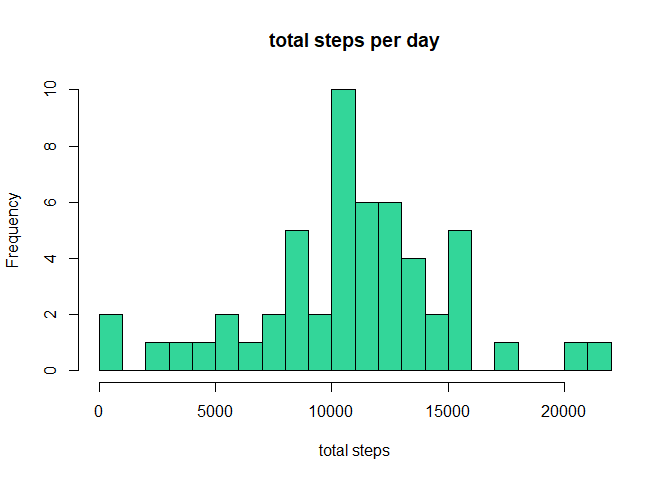
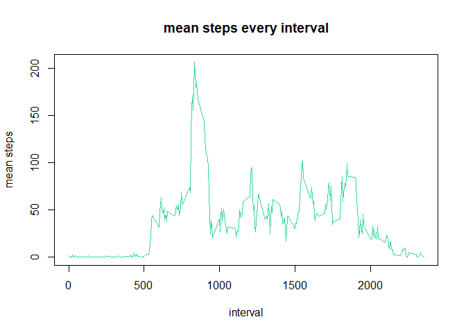
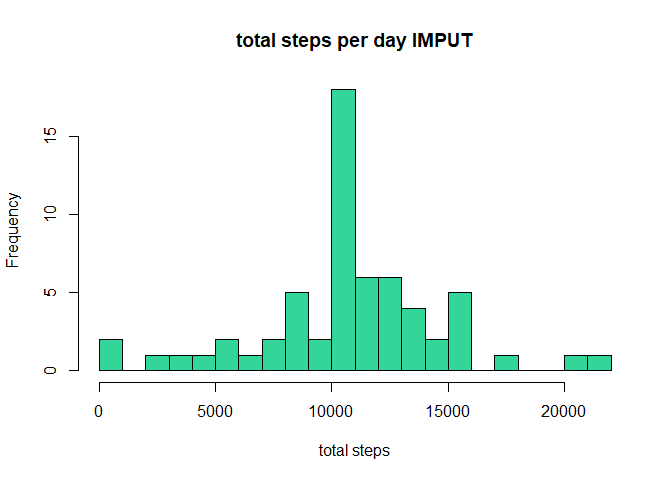
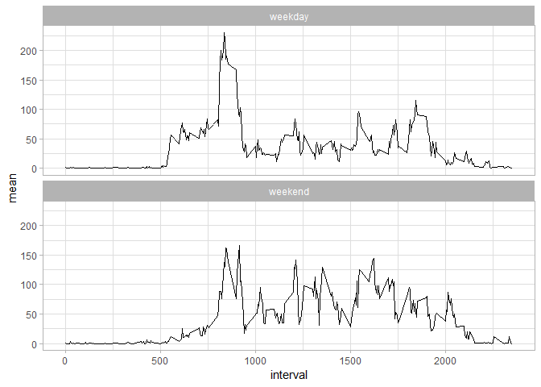

# Load the data

Process/transform the data (if necessary) into a format suitable for your analysis

```r
##download the file
fileURL<-"https://d396qusza40orc.cloudfront.net/repdata%2Fdata%2Factivity.zip"
download.file(fileURL,destfile="./data.zip")
unzip("data.zip")
##read the file and covert the date
data_act<-read.csv("activity.csv")
library(lubridate)
data_act[,2]<-lubridate::ymd(data_act[,2])
head(data_act,10)
```

```
##    steps       date interval
## 1     NA 2012-10-01        0
## 2     NA 2012-10-01        5
## 3     NA 2012-10-01       10
## 4     NA 2012-10-01       15
## 5     NA 2012-10-01       20
## 6     NA 2012-10-01       25
## 7     NA 2012-10-01       30
## 8     NA 2012-10-01       35
## 9     NA 2012-10-01       40
## 10    NA 2012-10-01       45
```

# What is mean total number of steps taken per day?

For this part of the assignment, you can ignore the missing values in the dataset.
Calculate the total number of steps taken per day

```r
library(dplyr)
##groupby and then summarize based on date
grp<-dplyr::group_by(data_act,date)
total_day<-dplyr::summarise(grp,total=sum(steps))
head(total_day,10)
```

```
## # A tibble: 10 x 2
##    date       total
##    <date>     <int>
##  1 2012-10-01    NA
##  2 2012-10-02   126
##  3 2012-10-03 11352
##  4 2012-10-04 12116
##  5 2012-10-05 13294
##  6 2012-10-06 15420
##  7 2012-10-07 11015
##  8 2012-10-08    NA
##  9 2012-10-09 12811
## 10 2012-10-10  9900
```

Make a histogram of the total number of steps taken each day

```r
hist(total_day$total,main="total steps per day",
     xlab="total steps",
     col=rgb(0,0.8,0.5,alpha=0.8),
     breaks=20)
```

<!-- -->

Calculate and report the mean and median of the total number of steps taken per day

```r
summary(total_day$total)
```

```
##    Min. 1st Qu.  Median    Mean 3rd Qu.    Max.    NA's 
##      41    8841   10765   10766   13294   21194       8
```

# What is the average daily activity pattern?

Make a time series plot of the 5-minute interval (x-axis) and the average number of steps taken, averaged across all days (y-axis)

```r
##again group by and summarize based on interval
grp2<-dplyr::group_by(data_act,interval)
mean_interval<-dplyr::summarise(grp2,mean=mean(steps,na.rm=TRUE))
plot(mean_interval$interval,mean_interval$mean,type="l",
     main="mean steps every interval",
     xlab="interval",
     ylab="mean steps",
     col=rgb(0,0.8,0.5,alpha=0.8))
```

<!-- -->

Which 5-minute interval, on average across all the days in the dataset, contains the maximum number of steps?

```r
mean_interval[which.max(mean_interval$mean),]
```

```
## # A tibble: 1 x 2
##   interval  mean
##      <int> <dbl>
## 1      835  206.
```

# Imputing missing values

Note that there are a number of days/intervals where there are missing values (coded as NA). 
Calculate and report the total number of missing values in the dataset (i.e. the total number of rows with NAs)

```r
sum(is.na(data_act))
```

```
## [1] 2304
```

Devise a strategy for filling in all of the missing values in the dataset. The strategy does not need to be sophisticated. For example, you could use the mean/median for that day, or the mean for that 5-minute interval, etc.
-my choice: the mean of 5-minute interval 

Create a new dataset that is equal to the original dataset but with the missing data filled in.

```r
##create a new dataframe
data_act_imput<-data_act
##get the mean value
grp2<-dplyr::group_by(data_act,interval)
mean_interval<-dplyr::summarise(grp2,mean=mean(steps,na.rm=TRUE))
##insert the value to the steps where they are NAs
for (i in 1:nrow(data_act_imput)){
    if (is.na(data_act_imput[i,1])==TRUE){
        row_interval<-data_act_imput[i,3]
        value<-dplyr::filter(mean_interval,interval==row_interval)
        data_act_imput[i,1]<-value[,2]
    }
}
head(data_act_imput,10)
```

```
##        steps       date interval
## 1  1.7169811 2012-10-01        0
## 2  0.3396226 2012-10-01        5
## 3  0.1320755 2012-10-01       10
## 4  0.1509434 2012-10-01       15
## 5  0.0754717 2012-10-01       20
## 6  2.0943396 2012-10-01       25
## 7  0.5283019 2012-10-01       30
## 8  0.8679245 2012-10-01       35
## 9  0.0000000 2012-10-01       40
## 10 1.4716981 2012-10-01       45
```

Make a histogram of the total number of steps taken each day and Calculate and report the mean and median total number of steps taken per day. 

```r
##groupby and summarize based on date for the new dataframe
grp3<-dplyr::group_by(data_act_imput,date)
total_day_imput<-dplyr::summarise(grp3,total=sum(steps))
hist(total_day_imput$total,main="total steps per day IMPUT",
     xlab="total steps",
     col=rgb(0,0.8,0.5,alpha=0.8),
     breaks=20)
```

<!-- -->

Do these values differ from the estimates from the first part of the assignment? What is the impact of imputing missing data on the estimates of the total daily number of steps?

```r
summary(total_day_imput$total)
```

```
##    Min. 1st Qu.  Median    Mean 3rd Qu.    Max. 
##      41    9819   10766   10766   12811   21194
```

```r
summary(total_day$total)
```

```
##    Min. 1st Qu.  Median    Mean 3rd Qu.    Max.    NA's 
##      41    8841   10765   10766   13294   21194       8
```

# Are there differences in activity patterns between weekdays and weekends?

For this part the weekdays() function may be of some help here. Use the dataset with the filled-in missing values for this part.Create a new factor variable in the dataset with two levels - "weekday" and "weekend" indicating whether a given date is a weekday or weekend day.

```r
data_act_imput[,2]<-lubridate::ymd(data_act_imput[,2])
##change the weekday to the nummeric format so that the ifelse logic can be easier later
weekday<-wday(data_act_imput[,2])
weekday_end<-ifelse(weekday==1|weekday==7,"weekend","weekday")
data_act_imput<-cbind(data_act_imput,weekday_end)
head(data_act_imput,10)
```

```
##        steps       date interval weekday_end
## 1  1.7169811 2012-10-01        0     weekday
## 2  0.3396226 2012-10-01        5     weekday
## 3  0.1320755 2012-10-01       10     weekday
## 4  0.1509434 2012-10-01       15     weekday
## 5  0.0754717 2012-10-01       20     weekday
## 6  2.0943396 2012-10-01       25     weekday
## 7  0.5283019 2012-10-01       30     weekday
## 8  0.8679245 2012-10-01       35     weekday
## 9  0.0000000 2012-10-01       40     weekday
## 10 1.4716981 2012-10-01       45     weekday
```

Make a panel plot containing a time series plot of the 5-minute interval (x-axis) and the average number of steps taken, averaged across all weekday days or weekend days (y-axis). See the README file in the GitHub repository to see an example of what this plot should look like using simulated data.

```r
##groupby based on interval and also weekday_end this time
grp4<-dplyr::group_by(data_act_imput,interval,weekday_end)
total_day_weekdayend<-dplyr::summarise(grp4,mean=mean(steps))
library(ggplot2)
g<-ggplot(total_day_weekdayend,aes(interval,mean))
g<-g+geom_line()+facet_wrap(~weekday_end,ncol=1)+theme_light()
print(g)
```

<!-- -->
